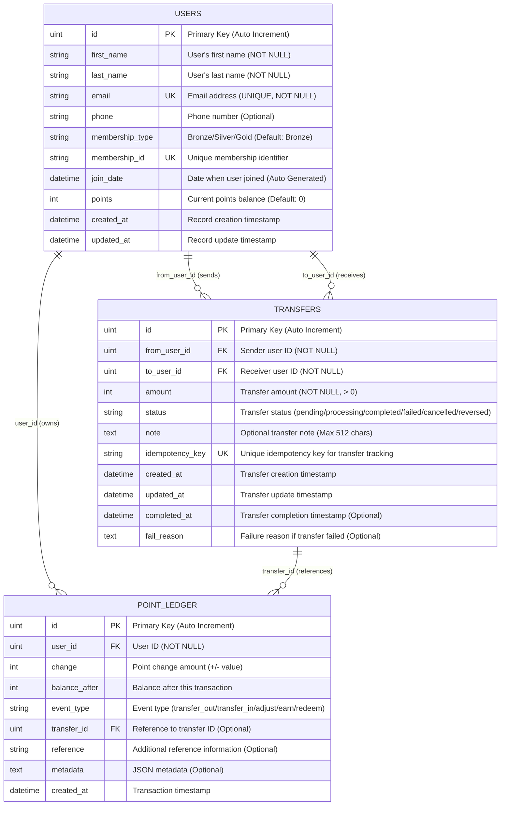

# Database Schema Documentation

## Overview

This document describes the database schema for the AI Backend Workshop project, built with Go + Fiber and SQLite using GORM ORM.

## Entity Relationship Diagram



## Current Implementation Status

### ✅ Implemented Tables

#### USERS Table
- **Status**: ✅ Fully implemented
- **Description**: Stores user account information and current points balance
- **Key Features**:
  - Unique email and membership ID constraints
  - Membership tiers (Bronze/Silver/Gold)
  - Point balance tracking
  - Auto-generated join date and timestamps

### 🚧 Planned Tables (For Transfer Feature)

#### TRANSFERS Table
- **Status**: 🚧 Designed (Ready for implementation)
- **Description**: Stores point transfer transactions between users
- **Key Features**:
  - Atomic transfer operations
  - Status tracking throughout transfer lifecycle
  - Idempotency key for duplicate prevention
  - Optional notes for transfer context

#### POINT_LEDGER Table
- **Status**: 🚧 Designed (Ready for implementation)
- **Description**: Append-only ledger for all point transactions
- **Key Features**:
  - Immutable transaction history
  - Balance tracking after each transaction
  - Support for various transaction types
  - Reference linking to transfers

## Database Constraints

### Primary Keys
- All tables use auto-incrementing integer primary keys (`id`)

### Foreign Keys
- `transfers.from_user_id` → `users.id`
- `transfers.to_user_id` → `users.id`
- `point_ledger.user_id` → `users.id`
- `point_ledger.transfer_id` → `transfers.id` (Optional)

### Unique Constraints
- `users.email` - Prevents duplicate email addresses
- `users.membership_id` - Ensures unique membership identifiers
- `transfers.idempotency_key` - Prevents duplicate transfers

### Check Constraints
- `transfers.amount > 0` - Ensures positive transfer amounts
- `transfers.status IN (...)` - Validates transfer status values
- `point_ledger.event_type IN (...)` - Validates transaction types

## Indexes (Planned for Performance)

### TRANSFERS Table Indexes
```sql
CREATE INDEX IF NOT EXISTS idx_transfers_from ON transfers(from_user_id);
CREATE INDEX IF NOT EXISTS idx_transfers_to ON transfers(to_user_id);
CREATE INDEX IF NOT EXISTS idx_transfers_created ON transfers(created_at);
CREATE INDEX IF NOT EXISTS idx_transfers_idem_key ON transfers(idempotency_key);
```

### POINT_LEDGER Table Indexes
```sql
CREATE INDEX IF NOT EXISTS idx_ledger_user ON point_ledger(user_id);
CREATE INDEX IF NOT EXISTS idx_ledger_transfer ON point_ledger(transfer_id);
CREATE INDEX IF NOT EXISTS idx_ledger_created ON point_ledger(created_at);
```

## Business Rules

### User Management
1. Email addresses must be unique across all users
2. Membership IDs must be unique and auto-generated
3. Default membership type is "Bronze"
4. Points balance defaults to 0 for new users

### Transfer Operations (When Implemented)
1. Users cannot transfer points to themselves
2. Transfer amounts must be positive integers
3. Transfers are atomic operations (all-or-nothing)
4. Sufficient balance is required before transfer
5. Each transfer creates two ledger entries (debit + credit)

### Point Ledger Rules (When Implemented)
1. Ledger is append-only (no updates/deletes)
2. Each entry records the balance after the transaction
3. All point changes must be recorded in the ledger
4. Transfer references link ledger entries to their originating transfers

## Sample Data Structure

### Current Users (Seed Data)
```json
[
  {
    "id": 1,
    "first_name": "สมชาย",
    "last_name": "ใจดี",
    "email": "somchai@example.com",
    "phone": "081-234-5678",
    "membership_type": "Gold",
    "membership_id": "LBK001234",
    "points": 15420
  },
  {
    "id": 2,
    "first_name": "สมหญิง",
    "last_name": "รักดี",
    "email": "somying@example.com",
    "phone": "089-765-4321",
    "membership_type": "Silver",
    "membership_id": "LBK001235",
    "points": 8750
  }
]
```

### Example Transfer Flow (When Implemented)
```json
{
  "transfer": {
    "id": 1,
    "from_user_id": 1,
    "to_user_id": 2,
    "amount": 500,
    "status": "completed",
    "note": "Thank you for help",
    "idempotency_key": "550e8400-e29b-41d4-a716-446655440001"
  },
  "ledger_entries": [
    {
      "user_id": 1,
      "change": -500,
      "balance_after": 14920,
      "event_type": "transfer_out",
      "transfer_id": 1
    },
    {
      "user_id": 2,
      "change": 500,
      "balance_after": 9250,
      "event_type": "transfer_in",
      "transfer_id": 1
    }
  ]
}
```

## Technology Stack

- **Database**: SQLite (for development)
- **ORM**: GORM v1.25.12
- **Migration**: Auto-migration via GORM
- **Language**: Go 1.17+
- **Framework**: Fiber v2.52.9

## Future Enhancements

1. **Transfer Feature Implementation**
   - Complete transfer repository layer
   - Point ledger management
   - Transaction rollback support

2. **Performance Optimization**
   - Add database indexes for common queries
   - Implement query optimization for large datasets

3. **Data Integrity**
   - Add database triggers for balance validation
   - Implement audit trails for sensitive operations

4. **Scalability**
   - Consider PostgreSQL for production
   - Implement connection pooling
   - Add read replicas for query performance

---

*Last Updated: November 10, 2025*  
*Project: AI Backend Workshop - Go + Fiber Clean Architecture*
